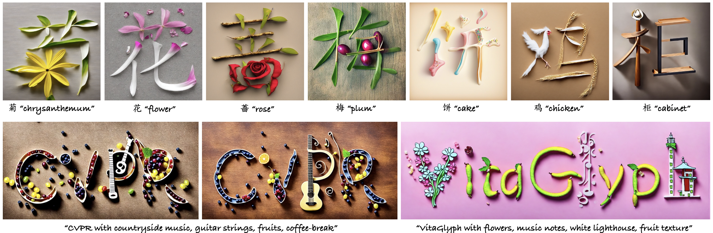
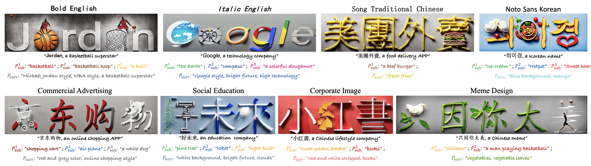

# VitaGlyph: Vitalizing Artistic Typography with Flexible Dual-branch Diffusion Models
#### Kailai Feng, Yabo Zhang, Haodong Yu, Zhilong Ji, Jinfeng Bai, Hongzhi Zhang<sup>*</sup>, Wangmeng Zuo 
This repository is the official PyTorch implementation of "VitaGlyph: Vitalizing Artistic Typography with Flexible Dual-branch Diffusion Models".

## ✨ News/TODO
- [x] Source code of Controllable Compositional Generation.
- [x] Source code of Semantic Typography
- [ ] Source code of Regional Decomposition
- [ ] Source code of whole pipeline and inference
- [ ] More results


## 🖼️ Resluts

<p align="center">
    
    </br> Artistic Typogrophy <tr>
</p>

<p align="center">
    
    </br> Customized Logo Design  <tr>
</p>


## 📖 Overview


<p align="center">
  
  </br>
  An overview of the pipeline.
</p>


## ⚙️ Run inference demo
1) Run the following command to get subject image and surrounding image.
``` shell

```
2) Run the following command to pre-process subject image and surrounding image.
``` shell
python SemTypo.py --resolution 1024 
```
3) Run the following command to get final results.
``` shell

```

<!-- You can change 'xN' to get arbitrary frame rates results. The reuslts are saved in the folder './output'. -->