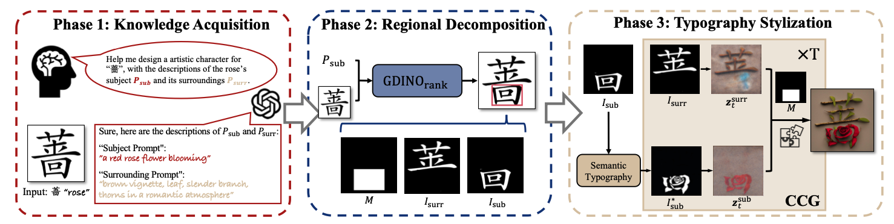

# VitaGlyph: Vitalizing Artistic Typography with Flexible Dual-branch Diffusion Models
#### Kailai Feng, Yabo Zhang, Haodong Yu, Zhilong Ji, Jinfeng Bai, Hongzhi Zhang<sup>*</sup>, Wangmeng Zuo 
This repository is the official PyTorch implementation of "VitaGlyph: Vitalizing Artistic Typography with Flexible Dual-branch Diffusion Models".

## ✨ News/TODO
- [ ] Source code of Controllable Compositional Generation.
- [x] Source code of Semantic Typography
- [ ] Source code of Regional Decomposition
- [ ] More results


<!-- 
## 🖼️ Resluts

<table class="center">
    <tr style="font-weight: bolder;text-align:center;">
        <td>Input starting frame</td>
        <td>Input ending frame</td>
        <td>Inbetweening results</td>
    </tr>
  <tr>
  <td>
    
  </td>
  <td>
    
  </td>
  <td>
    
  </td>
  </tr>
  <tr>
  <td>
    
  </td>
  <td>
    
  </td>
  <td>
    
  </td>
  </tr>
  <tr>
  <td>
    
  </td>
  <td>
    
  </td>
  <td>
    
  </td>
  </tr> 
</table>
 -->

## 📖 Overview


<p align="center">
  
  </br>
  An overview of the pipeline.
</p>


## ⚙️ Run inference demo
1) Run the following command to get subject image and surrounding image.
``` shell

```
2) Run the following command to pre-process subject image and surrounding image.
``` shell
python SemTypo.py --resolution 1024 
```
3) Run the following command to get final results.
``` shell

```

<!-- You can change 'xN' to get arbitrary frame rates results. The reuslts are saved in the folder './output'. -->