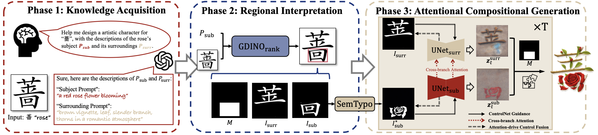
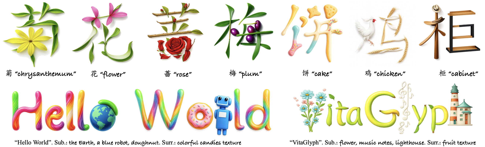
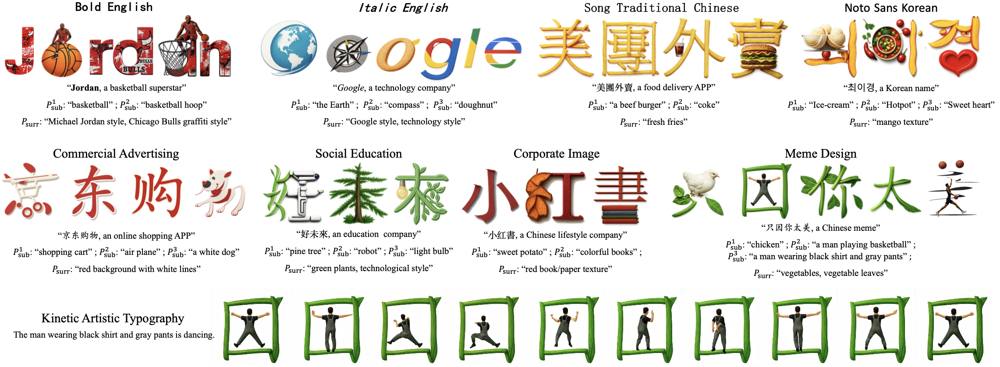

# VitaGlyph

**Vitalizing Artistic Typography with Flexible Dual-branch Diffusion Models**

Kailai Feng, Yabo Zhang, Haodong Yu, Zhilong Ji, Jinfeng Bai, Hongzhi Zhang, Wangmeng Zuo

PyTorch implementation of [VitaGlyph](https://arxiv.org/abs/2410.01738).
Generate artistic typography from a glyph image and manually supplied subject and surrounding prompts.

<p align="center">
  
</p>

## Installation

Tested with Python 3.9 and PyTorch 2.5.1. CUDA, Apple MPS and CPU are supported;
GPU inference is recommended. Model weights are downloaded from Hugging Face on first use.

```bash
git clone https://github.com/Carlofkl/VitaGlyph.git
cd VitaGlyph
python -m venv .venv
source .venv/bin/activate
python -m pip install -r requirements-preprocessing.txt
```

## Quick start

The pipeline runs **Grounding DINO → subject deformation → HED surrounding control → dual-ControlNet rendering**.
Knowledge Acquisition is omitted; supply both prompts yourself.

```bash
python VitaGlyph.py \
  --image examples/rose_glyph.jpg \
  --detection-prompt 'a rose flower' \
  --subject-prompt 'a red rose flower blooming' \
  --surrounding-prompt 'green leaves, slender branches and thorns, botanical illustration' \
  --positive-prompt 'botanical watercolor illustration, only flowers and leaves, Chinese calligraphy, plain white background' \
  --negative-prompt 'people, person, human, skin, nudity, body, portrait, blurry, low quality, cluttered background' \
  --output results/my_rose --seed 42 --generation-seed 45 --steps 20 \
  --gamma 1 --guidance-scale 5 --subject-scale 0.8 --surrounding-scale 0.8 \
  --no-attention-control
```

On Apple Silicon, append `--device mps --precision fp16 --deform-precision fp32 --variant fp16`.
The command above uses the tested fixed-control configuration: cross-branch attention is enabled,
while attention-driven control fusion is disabled. Remove `--no-attention-control` to enable that module.
This example demonstrates execution; visual quality and concept fidelity still need tuning.

Outputs are written to `results/my_rose/artistic.png`, with intermediate images and JSON metadata
in the same directory. Generated outputs are excluded from Git. `examples/rose_glyph.jpg` is an input,
not a generated result.

Useful options:

- `--text '蔷' --font /path/to/font.ttf`: render a glyph instead of supplying an image.
- `--deformation sds --sds-iterations 100`: use SDS-guided raster deformation instead of Depth2Img.
- `--resume`: reuse completed stages when commands and input/output hashes match.
- `--dry-run`: validate inputs and print commands without loading models.
- `--local-files-only`: use cached weights or explicit local model directories.

Detection retains boxes with confidence **≥ 0.4** and area ratio **5%–60%**, then selects
the highest-confidence box. The SDS option is a raster displacement-field adaptation inspired by
[Word-As-Image](https://github.com/WordAsImage/Word-As-Image), not its original vector optimizer.

## Individual stages and documentation

| Entry point | Purpose |
| --- | --- |
| `VitaGlyph.py` | Complete pipeline with manual prompts |
| `RegionDecomp.py` | Detect one region and export `sub`, `surr` and `mask` |
| `SemTypo.py` | Depth2Img subject deformation and HED preparation |
| `SDSDeform.py` | Optional SDS raster deformation |
| `ConComGen.py` | Final artistic rendering from prepared controls |

Use `python <entry_point>.py --help` for arguments.
See [pipeline usage](docs/pipeline.md), [preprocessing](docs/preprocessing.md), and
[generation details](docs/generation.md) for model paths, conventions and implementation limitations.

## Tests

```bash
python -m pip install -r requirements-dev.txt
python -m pytest tests -q
```

Tests cover region filtering, aligned controls, diffusion components, SDS gradients and pipeline continuation.
They do not measure artistic quality or establish exact reproduction of the paper.

## Paper examples

These are the repository's existing examples, not outputs from the quick-start run.

<p align="center">
  
  
</p>

## Acknowledgements

Built with [Diffusers](https://github.com/huggingface/diffusers),
[Grounding DINO](https://github.com/IDEA-Research/GroundingDINO), and
[ControlNet](https://github.com/lllyasviel/ControlNet).

This project is unrelated to the Vitaglyph evolution/spacetime project at vitaglyph.com.
